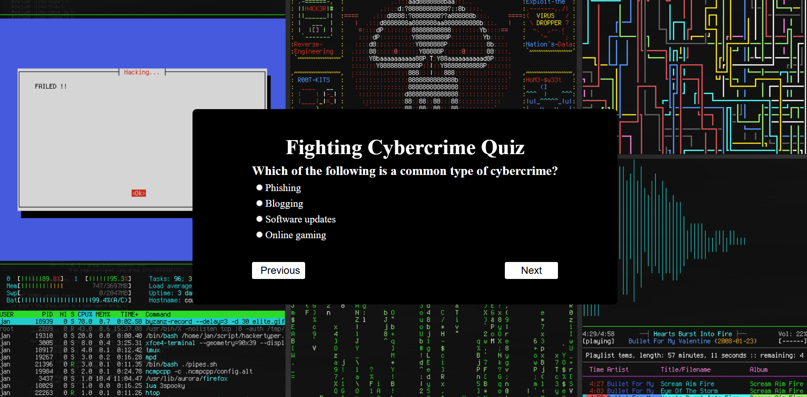

# Fighting Cybercrime Quiz 🔒

An interactive web-based quiz application designed to test and enhance knowledge about cybercrime, cybersecurity threats, and digital safety practices.

## 🖼️ Screenshots

### Homepage


## 🌟 Features

- **Interactive Quiz Experience**: Navigate through questions carefully crafted multiple-choice questions
- **Bidirectional Navigation**: Move forward and backward through questions with intuitive controls
- **Real-time Score Tracking**: Automatic scoring with results displayed at completion
- **Responsive Design**: Clean, modern interface that works across different screen sizes
- **Immediate Feedback**: Congratulatory message for perfect scores
- **User-Friendly Interface**: Dark theme with clear typography and smooth interactions

## 🎯 Quiz Topics

The quiz covers essential cybersecurity concepts including:
- Common cybercrime types (Phishing, Identity theft)
- Corporate vulnerability factors
- Personal data protection
- Dark Web and network protocols (Tor)
- Privacy tools and technologies (VPN)
- And More

## 🚀 Getting Started

### Prerequisites
- A modern web browser (Chrome, Firefox, Safari, Edge)
- No additional software or dependencies required

### Installation & Setup

1. **Clone or Download the Repository**
   ```bash
   git clone [repository-url]
   cd fighting-cybercrime-quiz
   ```

2. **Launch the Application**
   - Open `index.html` in your web browser
   - Or use a local server for development:
     ```bash
     # Using Python
     python -m http.server 8000
     
     # Using Node.js
     npx serve .
     ```

3. **Start Taking the Quiz**
   - Click through questions using the Next/Previous buttons
   - Select your answers using the radio buttons
   - View your final score at the end

## 📁 Project Structure

```
fighting-cybercrime-quiz/
├── assets/
│   └── images/
│       ├── homepage.png
│       ├── quiz-interface.png
│       └── results-page.png
├── index.html
├── style.css
├── main.js
├── README.md
└── LICENSE
```

## 🛠️ Technical Implementation

### Core Technologies
- **HTML5**: Semantic structure with accessibility considerations
- **CSS3**: Modern styling with flexbox layout and shadow effects
- **Vanilla JavaScript**: Pure JS implementation without external dependencies

### Key Components
- **Question Data Array**: Centralized question storage with correct answers
- **Navigation System**: Bidirectional movement through quiz questions
- **State Management**: Current question tracking and score calculation
- **DOM Manipulation**: Dynamic content updates and user interaction handling

### Code Highlights
- Clean separation of concerns between HTML, CSS, and JavaScript
- Reusable utility functions for DOM element selection
- Event-driven architecture for user interactions
- Responsive design principles

## 🎮 How to Use

1. **Start the Quiz**: Open the application in your browser
2. **Answer Questions**: Select one option from the multiple choices provided
3. **Navigate**: Use "Next" to proceed or "Previous" to review earlier questions
4. **Complete**: Finish all questions to see your final score
5. **Review**: Perfect scores receive special congratulations!

## 🔧 Customization Options

### Adding New Questions
Edit the `Data` array in `main.js`:
```javascript
const Data = [
    {
        question: "Your question here?",
        a: "Option A",
        b: "Option B", 
        c: "Option C",
        d: "Option D",
        correct: "a", // Letter corresponding to correct answer
    },
    // Add more questions...
];
```

### Styling Modifications
- Modify `style.css` to change colors, fonts, or layout
- Current theme uses a dark color scheme (#123 background)
- Easily customizable button styles and spacing

### Functionality Enhancements
- Add timer functionality
- Implement question randomization
- Include explanation for correct answers
- Add difficulty levels or categories

## 🐛 Known Issues & Limitations

- **Previous Button Bug**: There's a variable name inconsistency (`initialQuiz` vs `currentQuiz`) in the previous question function
- **CSS Duplication**: The stylesheet contains duplicate rule sets
- **Single Session**: Quiz state doesn't persist between browser sessions

## 🤝 Contributing

Contributions are welcome! Here are ways you can help:

1. **Bug Reports**: Submit issues for any bugs you encounter
2. **Feature Requests**: Suggest new functionality or improvements
3. **Code Contributions**: Fork the repository and submit pull requests
4. **Question Content**: Propose additional cybersecurity questions

### Development Guidelines
- Follow existing code style and structure
- Test thoroughly across different browsers
- Update documentation for any new features
- Maintain the educational focus of the content

## 📄 License

This project is licensed under the MIT License - see the [LICENSE](LICENSE) file for details.

## 🙏 Acknowledgments

- Created by Dinesh van Putten
- Designed for educational purposes in cybersecurity awareness
- Inspired by the need for accessible cybercrime education

## 📧 Support

For questions, suggestions, or support:
- Open an issue in the repository
- Review the code documentation
- Check browser console for any error messages

---
